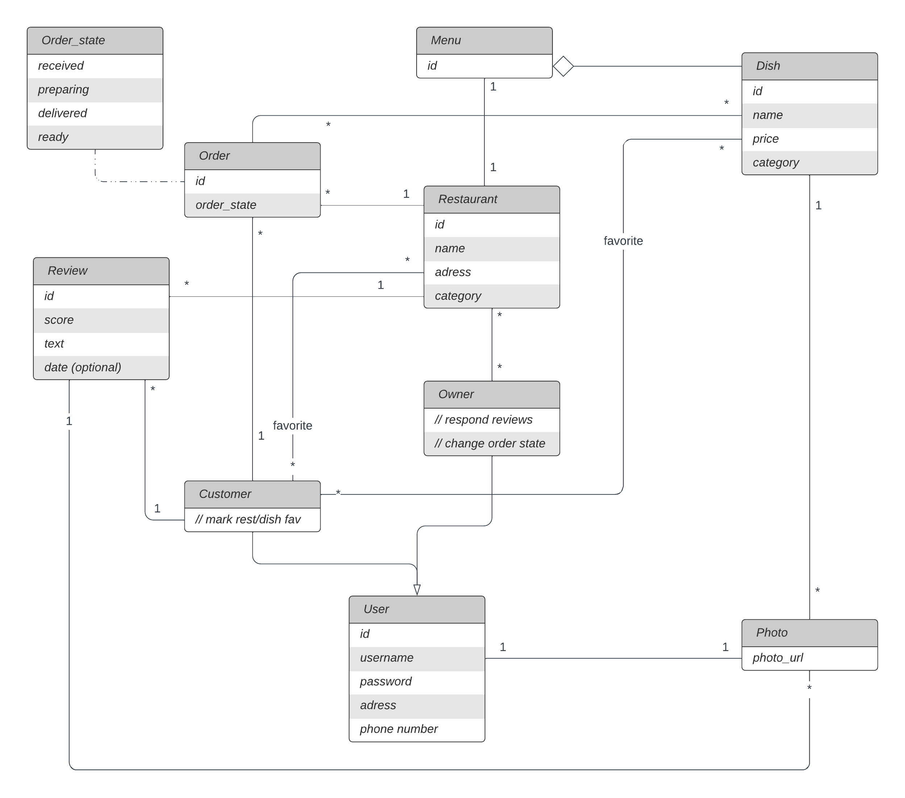

# LTW Project

# UML
- https://lucid.app/lucidchart/12829b35-a139-42d3-a574-8c573ef37b6b/edit?invitationId=inv_ab014954-bb30-4314-b856-a35b0319cc29
 

# Plan

## Week 6:
> - Mockups and navigation diagrams for the main pages
> - First draft of the database design.

## Week 7:
> - Finalize database script and create the database.
> - Partial implementation of some main pages and first CSS version.

## Week 8:
> - Most main pages implemented.

## Week 9:
> - All main pages implemented.
> - Start working on secondary features.

## Week 10:
> - Continue working on secondary features.
> - Start working on Javascript and Ajax.

## Week 11:
> - REST API or other secondary features.
> - Testing and code cleanup.

## Week 12:
> - Finish secondary features.
> - Main focus on security aspects.

## Week 13:
> - Testing and code cleanup.
